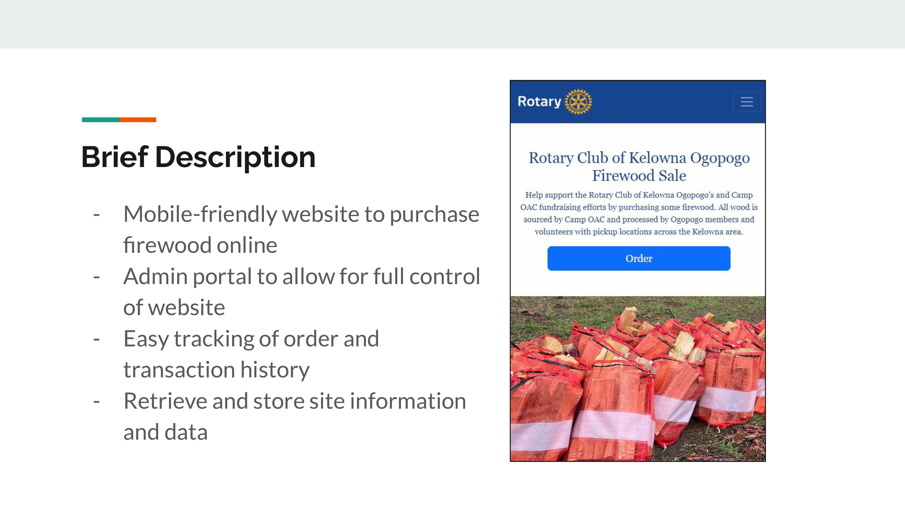
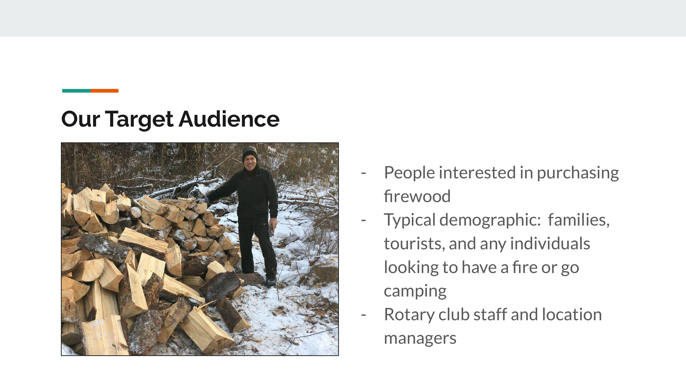
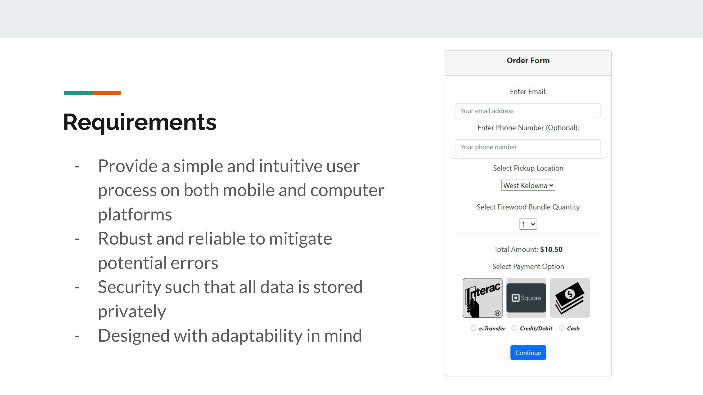
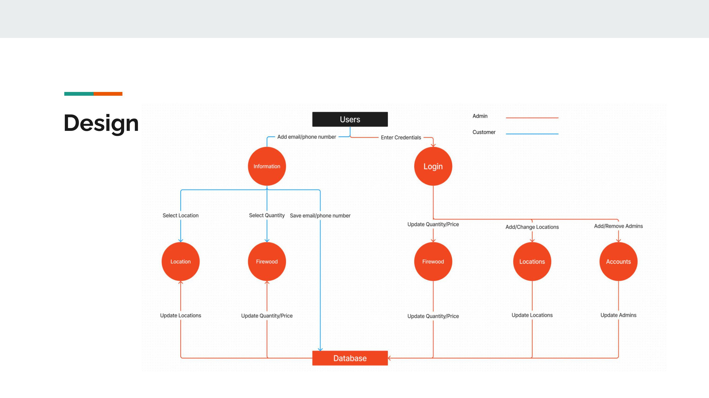
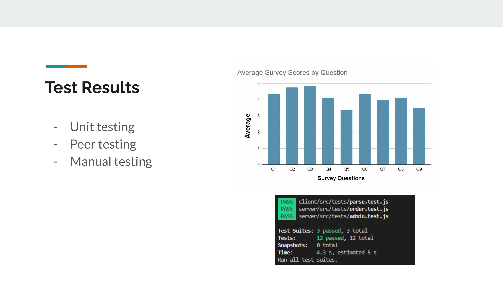
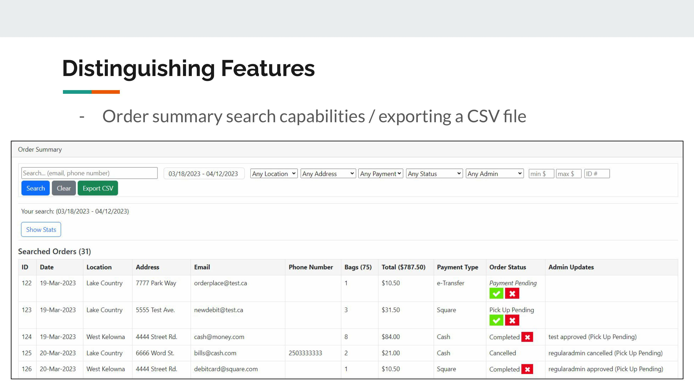
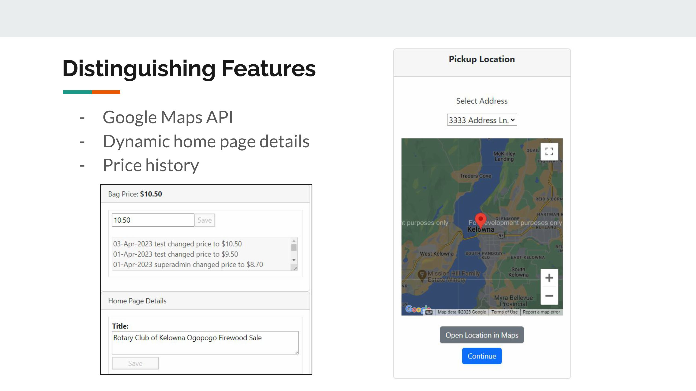
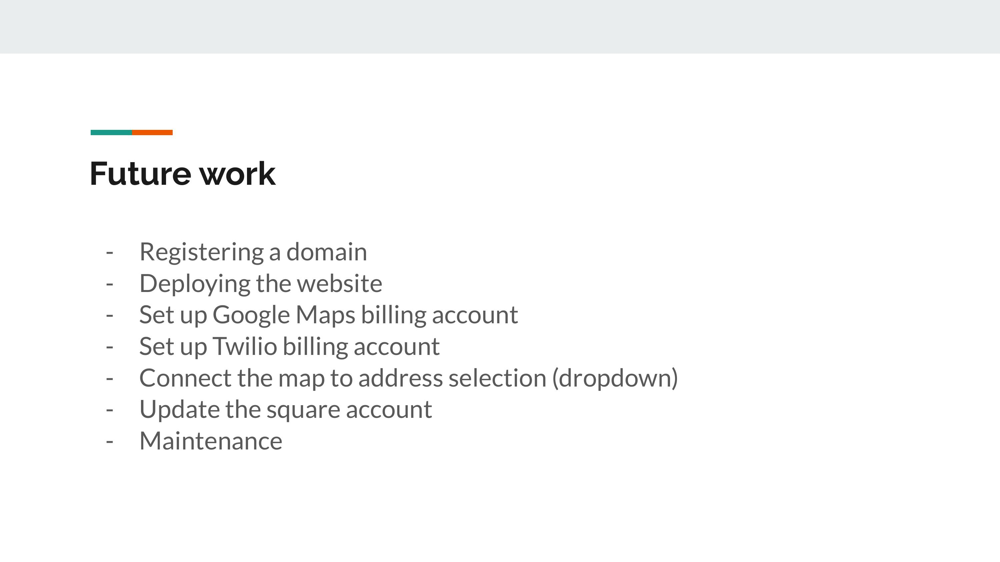
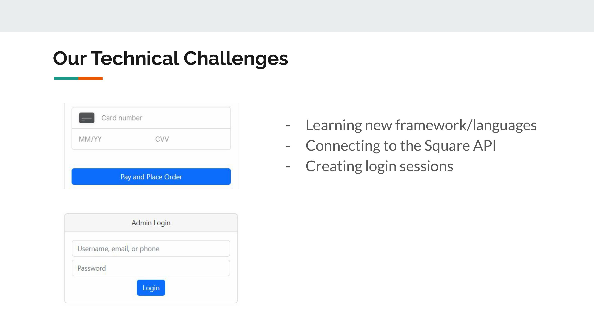

# COSC 499 Capstone Software Engineering Project
A project requiring team software development for an actual client. Our client being the Rotary Club of Kelowna Ogopogo in parternship with Camp OAC. We were tasked to build a mobile-friendly e-commerce site for the sale of firewood. Within the website we also to built an in-depth admin portal contatining inventory and admin management, website statistics, and sale history. Throughout the year we had to produce comprehensive
weekly reports, bi-weekly meetings with the client as well as deliver multiple presentations to students, faculty and clients.Out of the three groups tasked to build this site, ours was chosen for further development and employment by the client.
##

## Website Demo Video
